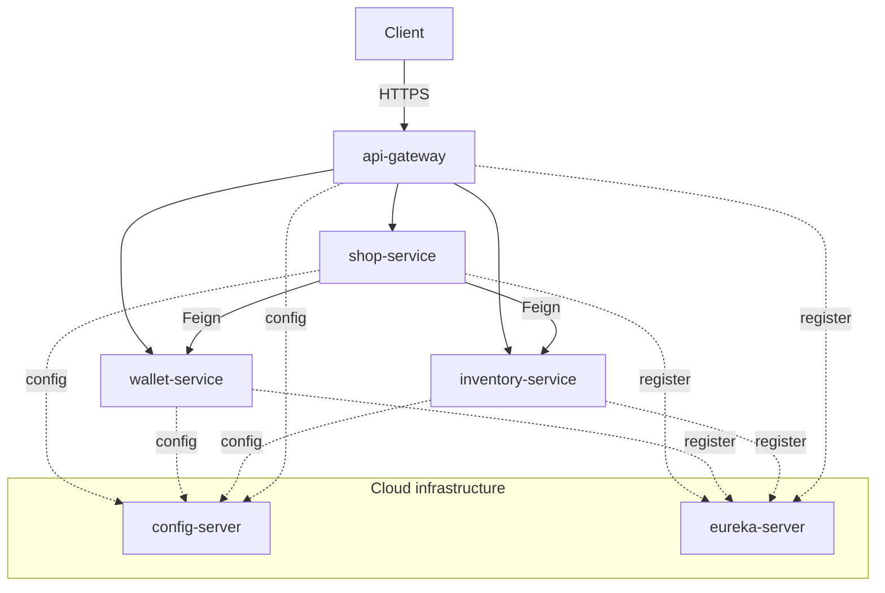

# Documentation Index

This folder is the full design & implementation plan for the e-commerce
microservices project. It is split into **small, self-contained files** so you
can read one concern without wading through the rest.

> New here? Read [`../CLAUDE.md`](../CLAUDE.md) first (project rules), then the
> [System Overview](architecture/01-system-overview.md), then jump to the
> [Implementation Plan](implementation-plan/README.md).

---

## 0. Source material
- [project-overview.md](project-overview.md) — the original brief from the course.
- [figma-analysis.md](figma-analysis.md) — how the two Figma designs map to backend features & endpoints.

## 1. Architecture
- [00-design-decisions.md](architecture/00-design-decisions.md) — **why this design deviates from the brief** (read this to understand the engineering choices).
- [01-system-overview.md](architecture/01-system-overview.md) — services, responsibilities, tech stack, high-level diagram.
- [02-service-topology.md](architecture/02-service-topology.md) — ports, databases, startup order, environment variables.
- [03-request-flows.md](architecture/03-request-flows.md) — sequence diagrams for auth and the checkout saga.
- [system-architecture.mmd](architecture/system-architecture.mmd) — the full topology as a standalone Mermaid flowchart; paste it directly into Excalidraw (top-left menu → **Insert** → **Mermaid to Excalidraw**) or any Mermaid renderer.

## 2. Domain models (one file per service)
- [wallet.md](domain/wallet.md)
- [inventory.md](domain/inventory.md)
- [shop.md](domain/shop.md)

## 3. API specifications
- [wallet-api.md](api/wallet-api.md)
- [inventory-api.md](api/inventory-api.md)
- [shop-api.md](api/shop-api.md)
- [inter-service-feign.md](api/inter-service-feign.md) — internal contracts between services.

## 4. Cloud infrastructure
- [config-server.md](infrastructure/config-server.md)
- [eureka.md](infrastructure/eureka.md)
- [api-gateway.md](infrastructure/api-gateway.md)
- [resilience4j.md](infrastructure/resilience4j.md)

## 5. Security
- [authentication-authorization.md](security/authentication-authorization.md) — JWT issuing, validation, roles.

## 6. Conventions
- [coding-standards.md](conventions/coding-standards.md)
- [git-and-collaboration.md](conventions/git-and-collaboration.md)
- [testing-strategy.md](conventions/testing-strategy.md)
- [agent-rules.md](conventions/agent-rules.md) — the full rulebook (mirrors CLAUDE.md §2).

## 7. Implementation plan (execute in order)
- [README.md](implementation-plan/README.md) — roadmap + status checklist.
- [phase-0-foundation.md](implementation-plan/phase-0-foundation.md)
- [phase-1-inventory-service.md](implementation-plan/phase-1-inventory-service.md)
- [phase-2-wallet-service.md](implementation-plan/phase-2-wallet-service.md)
- [phase-3-shop-service.md](implementation-plan/phase-3-shop-service.md)
- [phase-4-service-mesh.md](implementation-plan/phase-4-service-mesh.md)
- [phase-5-end-to-end.md](implementation-plan/phase-5-end-to-end.md)

---

### How the pieces relate

