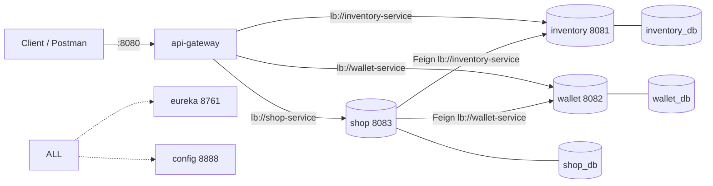

# Service Topology

## Port map

| Service | Port | Eureka name (`spring.application.name`) | Database schema |
|---------|------|------------------------------------------|-----------------|
| config-server     | `8888` | `config-server`     | — |
| eureka-server     | `8761` | `eureka-server`     | — |
| api-gateway       | `8080` | `api-gateway`       | — |
| inventory-service | `8081` | `inventory-service` | `inventory_db` |
| wallet-service    | `8082` | `wallet-service`    | `wallet_db`    |
| shop-service      | `8083` | `shop-service`      | `shop_db`      |

> Clients only ever talk to the **gateway on `8080`**. The service ports are for
> local debugging; in normal use they are reached through the gateway by their
> Eureka name.

## Startup order

Config and discovery must be up before anything that depends on them.

```
1. config-server   (8888)   ← everyone fetches config from here at boot
2. eureka-server   (8761)   ← everyone registers here
3. inventory-service (8081)
4. wallet-service    (8082)
5. shop-service      (8083) ← depends on inventory + wallet at runtime (Feign)
6. api-gateway       (8080) ← routes to all registered services
```

Services are resilient to a temporarily-missing dependency at runtime (that is
what Resilience4j is for), but at **first boot** config-server and eureka-server
should be running.

## Databases

- One MySQL instance, three schemas: `inventory_db`, `wallet_db`, `shop_db`.
- Each service connects **only** to its own schema. No cross-schema queries, no
  shared tables, no foreign keys across services.
- Create schemas before first run:
  ```sql
  CREATE DATABASE inventory_db;
  CREATE DATABASE wallet_db;
  CREATE DATABASE shop_db;
  ```
- JPA `ddl-auto`: use `update` during development; document the final schema and
  switch to `validate` (with SQL migration scripts) if time allows.

## Configuration & secrets

Nothing secret is committed. Each service reads these from the environment (or a
git-ignored `application-local.yml`). Config-server serves the non-secret parts.

| Variable | Used by | Example (placeholder) |
|----------|---------|-----------------------|
| `DB_URL`        | all business services | `jdbc:mysql://localhost:3306/inventory_db` |
| `DB_USERNAME`   | all business services | `root` |
| `DB_PASSWORD`   | all business services | `${DB_PASSWORD}` |
| `JWT_SECRET`    | wallet + gateway + services | `${JWT_SECRET}` (min 256-bit) |
| `JWT_EXPIRATION_MS` | wallet-service | `3600000` |
| `CONFIG_SERVER_URL` | all | `http://localhost:8888` |
| `EUREKA_URL`    | all | `http://localhost:8761/eureka` |

See [../infrastructure/config-server.md](../infrastructure/config-server.md) for
how config is layered (bootstrap → config-server → local override).

## Network diagram


