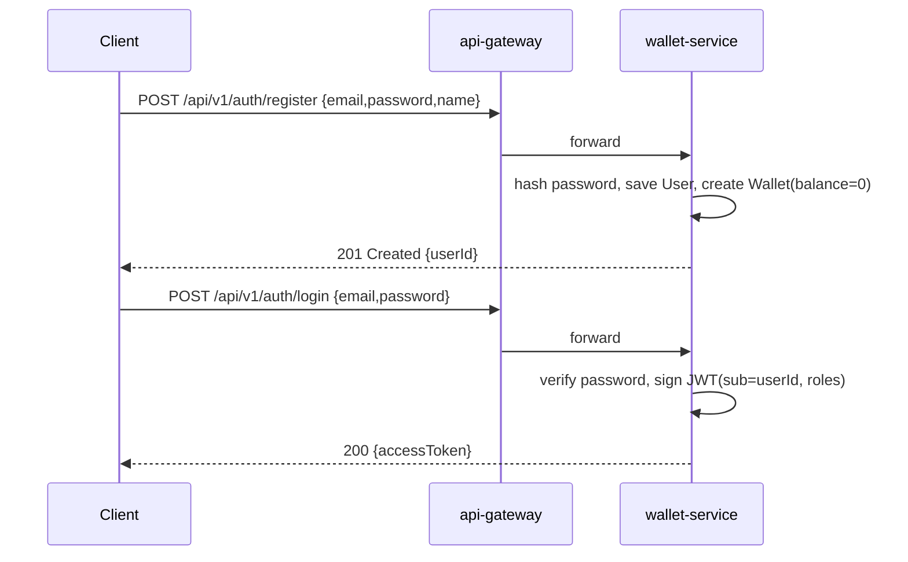
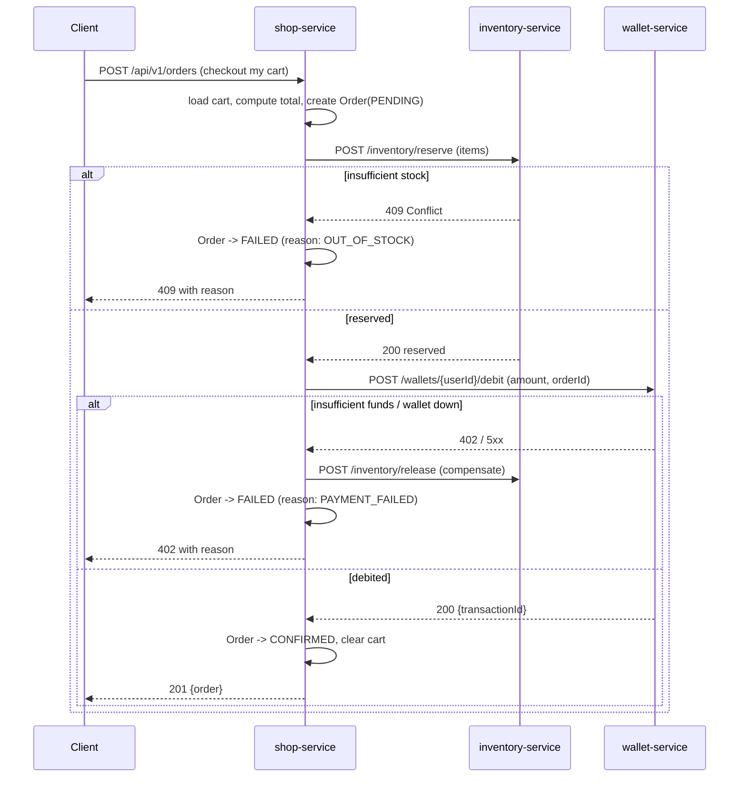

# Request Flows

Two flows are worth drawing out because they cross service boundaries: **login**
and **checkout**. Everything else is a straightforward single-service CRUD call.

---

## 1. Registration & login (auth)

Auth is owned by `wallet-service`. Registration also creates the user's wallet
in the same transaction.

The client then sends `Authorization: Bearer <token>` on every subsequent call.
See [../security/authentication-authorization.md](../security/authentication-authorization.md)
for how the gateway and services validate that token.

---

## 2. Checkout (the interesting one)

Checkout spans **three services** and must not leave the system inconsistent
(e.g. stock reserved but wallet not charged). We use a **synchronous
orchestration saga** driven by `shop-service`, with compensating actions on
failure. Every outbound call is wrapped in a Resilience4j circuit breaker.

### Order states
`PENDING → CONFIRMED` (happy path) — or — `PENDING → FAILED` (stock or payment
failure, with any reservation released). `CONFIRMED → CANCELLED` is a later,
user-initiated action that credits the wallet back and releases stock.

### Idempotency
The debit call carries the `orderId` as an idempotency key so a retry (from
Resilience4j) cannot double-charge. See
[../api/inter-service-feign.md](../api/inter-service-feign.md).

### Why synchronous, not event-driven?
The course scope centres on Feign + Resilience4j, not a message broker.
Synchronous orchestration with compensating calls demonstrates the resilience
concepts cleanly. A note in [phase-3](../implementation-plan/phase-3-shop-service.md)
calls out where a message queue would replace this in a production system.
