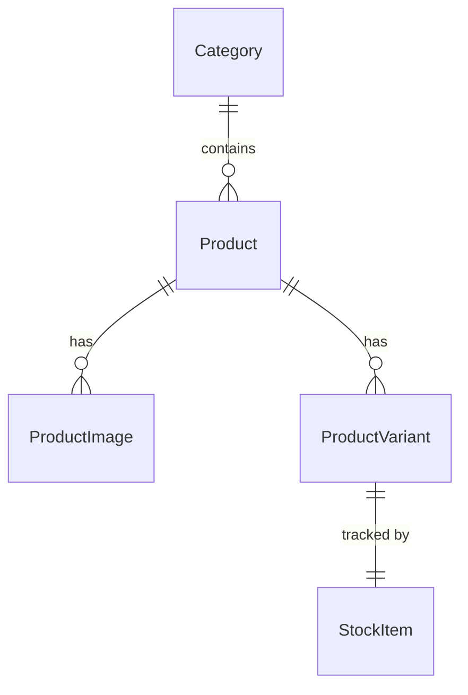

# Domain Model — inventory-service

Owns everything about **what products exist** and **how many are in stock**.
Schema: `inventory_db`.

## Entities

### Category
The browsable groupings seen in both designs (Modeva: Formal/Casual × Men/Women;
StepUp: Man/Woman/Boy/Child). Modelled as a flat list with an optional parent to
allow simple nesting.

| Field | Type | Notes |
|-------|------|-------|
| id | Long (PK) | |
| name | String | e.g. "Formal Women", "Sneakers" |
| slug | String (unique) | URL-friendly, e.g. `formal-women` |
| parentId | Long (nullable) | optional self-reference for sub-categories |
| createdAt / updatedAt | Instant | auditing |

### Product
The product master record. Shopper-facing display data lives here; shopping
actions (cart/order) do **not**.

| Field | Type | Notes |
|-------|------|-------|
| id | Long (PK) | |
| name | String | "Slick formal sneaker shoe" |
| description | Text | |
| brand | String (nullable) | |
| categoryId | Long (FK→Category) | |
| basePrice | BigDecimal | current selling price |
| compareAtPrice | BigDecimal (nullable) | original price for "on sale" str/through display (StepUp shows both) |
| currency | String(3) | e.g. `EGP`, `INR` — store minor-unit-safe with BigDecimal |
| isNew | boolean | drives the "New" badge |
| isActive | boolean | soft delete / hide from catalog |
| ratingAverage | BigDecimal(2,1) | denormalised, updated by shop-service reviews (see note) |
| ratingCount | int | denormalised |
| createdAt / updatedAt | Instant | |

> **Rating denormalisation:** reviews live in `shop-service`. Two acceptable
> options — (a) shop-service calls inventory via Feign to update
> `ratingAverage/ratingCount` when a review is posted, or (b) inventory omits
> rating fields and shop-service returns ratings alongside catalog data. Pick (a)
> for simpler catalog reads; document the choice in Phase 1.

### ProductImage
Products have multiple images (galleries in both designs).

| Field | Type | Notes |
|-------|------|-------|
| id | Long (PK) | |
| productId | Long (FK→Product) | |
| url | String | |
| position | int | display order; 0 = primary |

### ProductVariant
Shoes have **sizes**; clothes have **size + colour**. A variant is the actually
purchasable/stock-tracked unit (a SKU).

| Field | Type | Notes |
|-------|------|-------|
| id | Long (PK) | |
| productId | Long (FK→Product) | |
| sku | String (unique) | |
| size | String (nullable) | "42", "M", "L" |
| color | String (nullable) | "Black" |
| priceOverride | BigDecimal (nullable) | if this variant costs differently |

### StockItem (inventory level)
Separated from variant so stock movements are auditable and reservations are
explicit.

| Field | Type | Notes |
|-------|------|-------|
| id | Long (PK) | |
| variantId | Long (FK→ProductVariant, unique) | |
| quantityOnHand | int | physical stock |
| quantityReserved | int | reserved by pending/confirmed orders |
| — | | **available = quantityOnHand − quantityReserved** |

Reservation semantics (called by shop-service during checkout):
- **reserve**: `quantityReserved += n` if `available >= n`, else 409.
- **release**: `quantityReserved -= n` (order failed/cancelled).
- **commit/fulfil** (optional): `quantityOnHand -= n; quantityReserved -= n` when
  order ships. For course scope you may collapse commit into reserve.

## Relationships

## Notes
- No `User`/`Order` entities here — those belong to other services.
- Keep money in `BigDecimal`; never `double`.
- Seed data (categories + a handful of products/variants/stock) should be loaded
  via a `data.sql` or a `CommandLineRunner` so the catalog is non-empty for demos.
