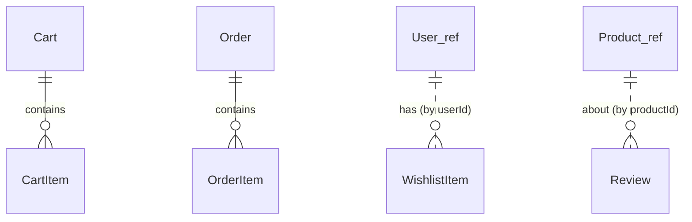

# Domain Model — shop-service

Owns the **shopper's activity**: cart, wishlist, orders, and reviews. It holds
**no product master data** — it stores product *references* (ids) and calls
`inventory-service` for live details/price/stock. Schema: `shop_db`.

## Entities

### Cart & CartItem
One active cart per user.

**Cart**
| Field | Type | Notes |
|-------|------|-------|
| id | Long (PK) | |
| userId | Long | one active cart per user |
| updatedAt | Instant | |

**CartItem**
| Field | Type | Notes |
|-------|------|-------|
| id | Long (PK) | |
| cartId | Long (FK→Cart) | |
| productId | Long | reference into inventory-service |
| variantId | Long | the chosen size/colour SKU |
| quantity | int | |
| unitPriceSnapshot | BigDecimal | price captured when added (recomputed at checkout) |

> Store a **snapshot** price for display, but always **re-fetch the authoritative
> price from inventory at checkout** so a stale cart can't lock in an old price.

### WishlistItem
The heart icon on product cards (both designs) / Modeva "favourites".

| Field | Type | Notes |
|-------|------|-------|
| id | Long (PK) | |
| userId | Long | |
| productId | Long | |
| createdAt | Instant | (userId, productId) unique |

### Order & OrderItem
Created at checkout; immutable snapshot of what was bought.

**Order**
| Field | Type | Notes |
|-------|------|-------|
| id | Long (PK) | |
| orderNumber | String (unique) | human-friendly, e.g. `ORD-2026-000123` |
| userId | Long | |
| status | enum | `PENDING`,`CONFIRMED`,`FAILED`,`CANCELLED` |
| failureReason | String (nullable) | `OUT_OF_STOCK`, `PAYMENT_FAILED` |
| subtotal | BigDecimal | |
| discountTotal | BigDecimal | from applied coupon (Modeva vouchers) |
| grandTotal | BigDecimal | |
| currency | String(3) | |
| paymentTransactionId | String (nullable) | id returned by wallet debit |
| createdAt / updatedAt | Instant | |

**OrderItem**
| Field | Type | Notes |
|-------|------|-------|
| id | Long (PK) | |
| orderId | Long (FK→Order) | |
| productId / variantId | Long | references into inventory |
| productNameSnapshot | String | so the order reads correctly even if product later changes |
| unitPrice | BigDecimal | |
| quantity | int | |
| lineTotal | BigDecimal | |

### Review
The "Customer Review" / ratings sections in both designs.

| Field | Type | Notes |
|-------|------|-------|
| id | Long (PK) | |
| productId | Long | reference into inventory |
| userId | Long | author |
| authorNameSnapshot | String | shown in the review card |
| rating | int (1–5) | |
| title | String (nullable) | |
| body | Text | |
| createdAt | Instant | |

> Constraint: (productId, userId) unique — one review per user per product.
> Optionally require that the user has a `CONFIRMED` order for that product
> before allowing a review ("verified purchase").

### Coupon *(optional — Modeva "Vouchers and Discounts")*
| Field | Type | Notes |
|-------|------|-------|
| id | Long (PK) | |
| code | String (unique) | |
| type | enum | `PERCENT`, `FIXED` |
| value | BigDecimal | |
| expiresAt | Instant | |
| active | boolean | |

Mark clearly as a stretch feature; core checkout must work without it.

## Relationships

(`User_ref` / `Product_ref` are *references by id* to other services, not local tables.)

## Notes
- shop-service never queries `wallet_db` or `inventory_db`. All external data via
  Feign — see [../api/inter-service-feign.md](../api/inter-service-feign.md).
- `userId` comes from the validated JWT (the `sub` claim), not from the request body.
