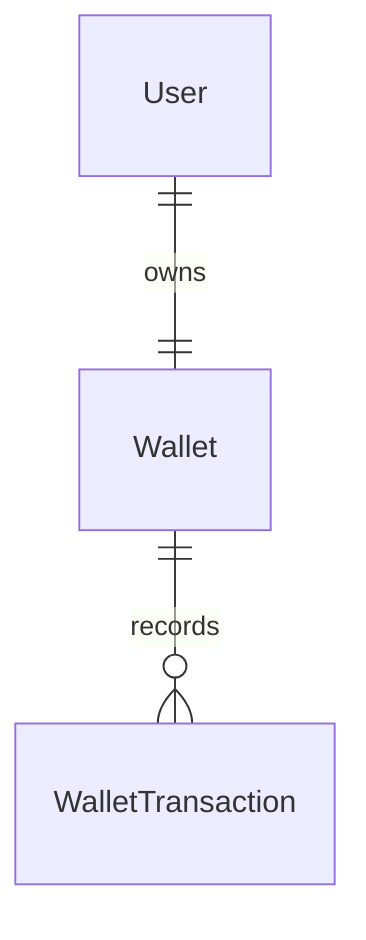

# Domain Model — wallet-service

Owns **users**, **authentication**, and **money** (wallet balance + the ledger of
transactions). Schema: `wallet_db`.

## Entities

### User
The account behind "My Account" in both designs.

| Field | Type | Notes |
|-------|------|-------|
| id | Long (PK) | this is the `userId` referenced by other services |
| email | String (unique) | login identifier |
| passwordHash | String | BCrypt; **never** store plaintext |
| fullName | String | |
| phone | String (nullable) | Modeva footer shows WhatsApp/phone contact |
| role | enum `USER`/`ADMIN` | ADMIN manages catalog |
| enabled | boolean | |
| createdAt / updatedAt | Instant | |

### Wallet
One wallet per user, created at registration.

| Field | Type | Notes |
|-------|------|-------|
| id | Long (PK) | |
| userId | Long (FK→User, unique) | |
| balance | BigDecimal | never negative; guarded in service layer |
| currency | String(3) | |
| createdAt / updatedAt | Instant | |
| version | Long (`@Version`) | optimistic lock to prevent lost updates on concurrent debit |

### WalletTransaction (ledger)
Append-only history — powers the "transaction history" requirement and audit.

| Field | Type | Notes |
|-------|------|-------|
| id | Long (PK) | |
| walletId | Long (FK→Wallet) | |
| type | enum | `DEPOSIT`, `WITHDRAWAL`, `PAYMENT`, `REFUND` |
| amount | BigDecimal | always positive; `type` gives direction |
| balanceAfter | BigDecimal | snapshot for statements |
| referenceId | String (nullable) | e.g. the `orderId` for PAYMENT/REFUND |
| idempotencyKey | String (unique, nullable) | prevents double-processing of a retried debit |
| status | enum | `SUCCESS`, `FAILED` |
| createdAt | Instant | |

## Rules
- **Never** let `balance` go below zero. A debit that would overdraw returns a
  domain error (mapped to HTTP 402), and no transaction (or a `FAILED` one) is
  recorded.
- Debit and credit mutate `Wallet.balance` and append a `WalletTransaction`
  **in the same DB transaction**.
- Concurrency: use `@Version` optimistic locking (or `SELECT ... FOR UPDATE`) so
  two simultaneous payments cannot both read the old balance.
- **Idempotency:** a `PAYMENT` carries the order's key; if a transaction with the
  same `idempotencyKey` already exists, return the previous result instead of
  charging again. This makes Feign/Resilience4j retries safe.

## Relationships

## Notes
- This service is the **identity provider**: it signs JWTs. See
  [../security/authentication-authorization.md](../security/authentication-authorization.md).
- Other services never see the wallet DB; they call the internal debit/credit
  endpoints in [../api/inter-service-feign.md](../api/inter-service-feign.md).
